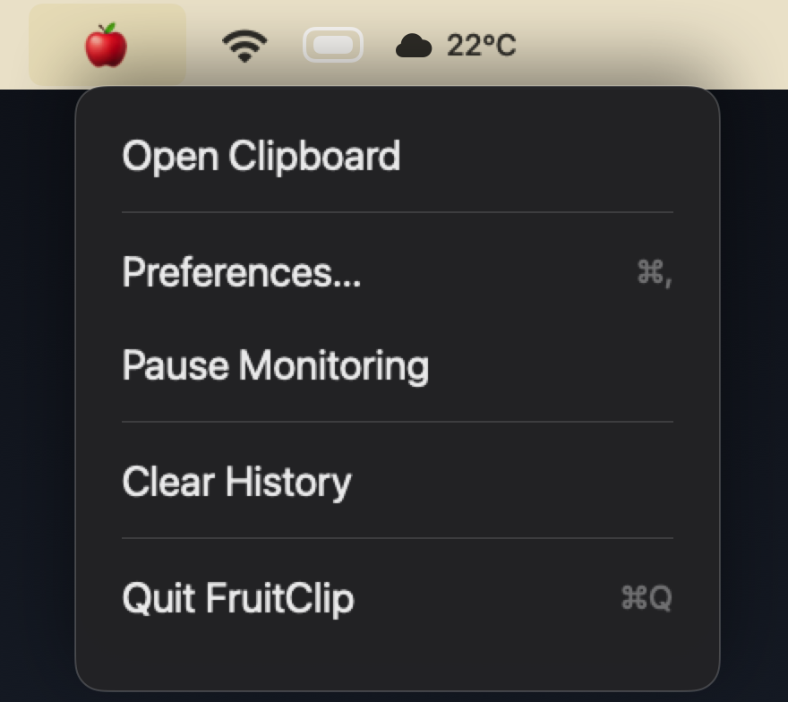
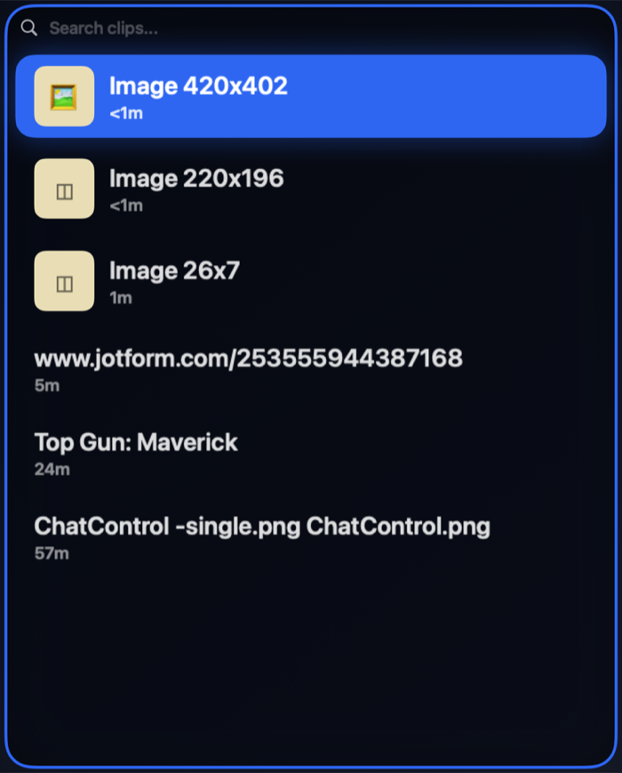
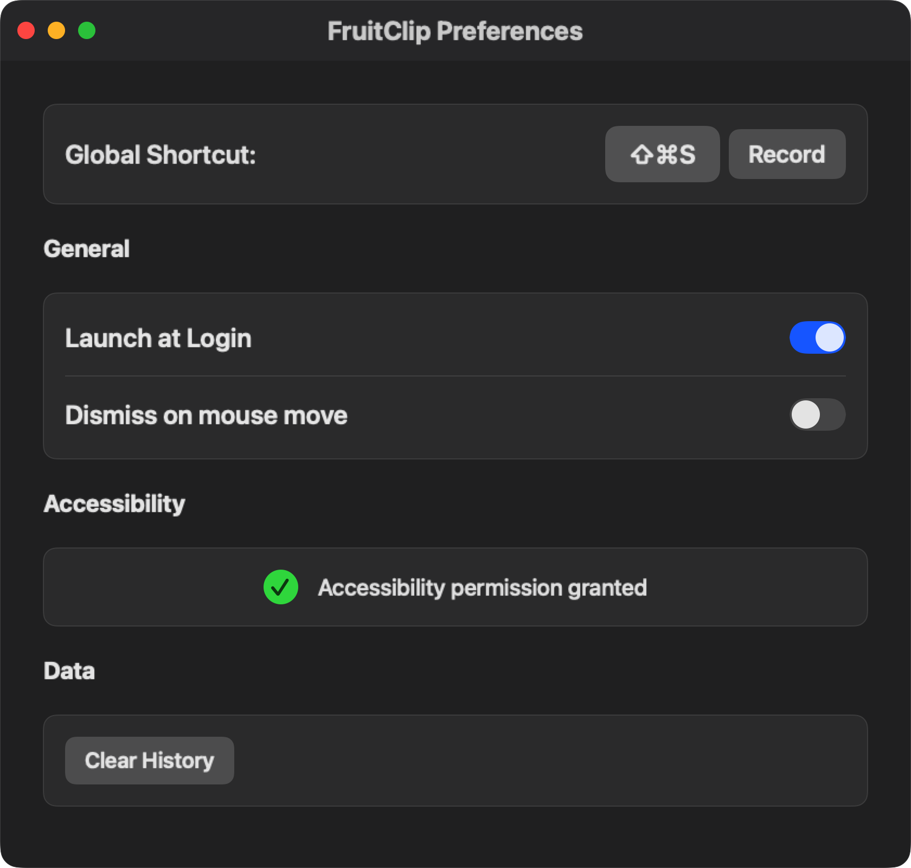

# FruitClip
<div align="center">
    
</div>

FruitClip is a lightweight native macOS clipboard manager that lives in your menu bar — press a shortcut to search, navigate, and paste anything you've copied.

## App Preview

<table>
  <tr>
    <td width="33%"><br><sub>Menu bar controls</sub></td>
    <td width="33%"><br><sub>Clipboard popup</sub></td>
    <td width="33%"><br><sub>Preferences</sub></td>
  </tr>
</table>

## What You Get

- **Menu bar clipboard manager** with a clean, native feel
- **Board + Stars** — browse your full clipboard history on the Board tab, or keep important clips on Stars
- **Global shortcuts** to open the Board or Stars from anywhere (default: `⌘⇧V`)
- **Text and image support** — images display full-width previews in the popup
- **Search** text clips instantly inside the popup
- **Full keyboard flow** — arrows to navigate, `Enter` to paste, `S` to star, `D` to delete, `F` to switch to Stars, `⌘C` to copy without pasting, `⌘F` to focus search
- **Auto-paste into the previous app** when Accessibility access is granted
- **Retention policies** — set how long Board and Stars history is kept (1 day to never)
- **Up to 100 items** in history, default 50, configurable in preferences
- **Customizable shortcuts** — rebind every action in the Shortcuts tab
- **Font size control** — adjust the popup text size from 11 to 15 pt
- **Dismiss on mouse move** — optionally close the popup when the cursor leaves
- **Pause monitoring, clear history, and launch at login** from the menu bar or preferences
- **Local-only storage** — your clipboard history never leaves your Mac

## Install

Build the app bundle first, then run the installer:

```bash
./build.sh
./install.sh
```

The installer copies `FruitClip.app` to `/Applications`, clears the quarantine flag, and launches the app.

To uninstall:

```bash
./uninstall.sh           # removes the app
./uninstall.sh --wipe-data  # removes the app and all clipboard data
```

## Quick Use

1. Copy text or images as you normally would.
2. Press `⌘⇧V` to open the Board.
3. Type to filter, or move through the list with arrow keys.
4. Press `Enter` to paste the selected item back into the app you were using.
5. Press `S` to star an item, `D` to delete it, or `F` to switch to your Stars.

## Permissions

FruitClip needs **Accessibility** access for automatic paste into other apps.

Grant it in **System Settings → Privacy & Security → Accessibility → FruitClip**.

Without it, FruitClip still copies the selected item to your clipboard — paste it manually with `⌘V`.

## Developer Setup

**Requirements:** macOS 15.0+, Swift 6.0+ (Xcode 16 or Command Line Tools)

```bash
git clone https://github.com/virajparmaj/fruit-clip
cd fruit-clip
swift build        # debug build
swift test         # run tests
./build.sh         # release build + .app bundle
open FruitClip.app # launch
```
